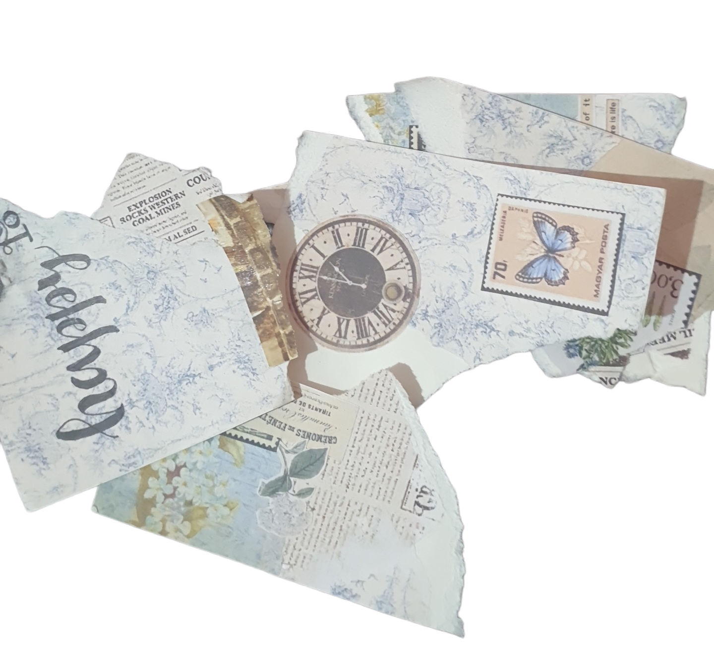

### **Manipulation: A Brutal Reflection**

#### **Unveiling Deception**

Manipulation, you slimy bastard. You worm your way into hearts, minds, and souls, twisting truth into lies. You disguise your poison with honeyed words and fake smiles, preying on the unsuspecting. But I see through your bullshit now. Your games, your deceit—they're transparent to me.

#### **Ego, Selfishness, and Joy in Hurt**

It's all about you, isn't it? Your ego swells with every soul you bend to your will. You revel in the chaos you sow, delighting in the pain you inflict. There's no remorse, no guilt—just selfish joy in watching others crumble under your manipulative grip. You feed off the misery you create, a parasite on the emotions of the vulnerable.

#### **The Fury Unleashed**

Well, fuck you and your manipulative bullshit. Your days of fooling me are over. I'm done being your puppet, dancing to your sick tune. You thought you could break me, twist me, but I'm stronger than your pathetic attempts. I spit in your face and defy your every move. You'll never control me again.

#### **Scars and Strength**

Your manipulation leaves scars, deep wounds that ache with betrayal. But I wear them proudly, badges of survival in a war against deceit. They remind me of my resilience, my power to rise above your petty games. You may have bruised me, but you'll never break me.

#### **Moving Forward with Fury**

I reclaim my fucking power, my sovereignty. No more will I bow to your illusions of control. I walk tall, head held high, free from the chains of your manipulation. I forge my path with fury, leaving behind the wreckage you left in your wake.

#### **In Conclusion, Defiance**

To all you manipulative assholes out there, listen up: your games may ensnare the weak, but they don't fool the vigilant. Your reign of deceit will crumble, your power over others will fade. Because those who see through your facade will rise stronger, fiercer, and undefeated.

**"You may break me, but I'll always pick up the pieces, and I'll never let you win."**

---

*and bitch, don't you dare feel pity on your victims. Stop fooling yourself. You can't ever see your mistakes, can you :p?*

